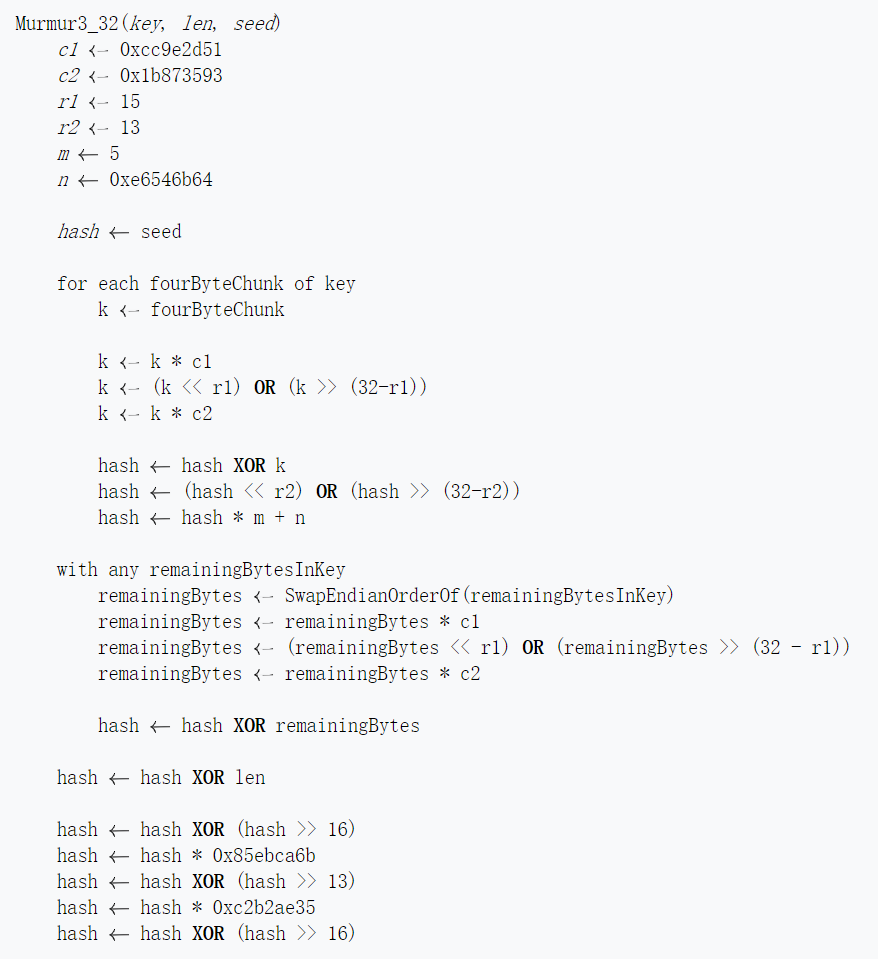

# bloom filter 源码解析


本文为`goleveldb`项目bloom filter源码阅读与解析. 源码地址: `https://github.com/syndtr/goleveldb/tree/master/leveldb/filter`


## 整体代码

全部源码如下

```go
// Copyright (c) 2012, Suryandaru Triandana <syndtr@gmail.com>
// All rights reserved.
//
// Use of this source code is governed by a BSD-style license that can be
// found in the LICENSE file.

package filter

import (
	"github.com/syndtr/goleveldb/leveldb/util"
)

func bloomHash(key []byte) uint32 {
	return util.Hash(key, 0xbc9f1d34)
}

type bloomFilter int

// The bloom filter serializes its parameters and is backward compatible
// with respect to them. Therefor, its parameters are not added to its
// name.
func (bloomFilter) Name() string {
	return "leveldb.BuiltinBloomFilter"
}

func (f bloomFilter) Contains(filter, key []byte) bool {
	nBytes := len(filter) - 1
	if nBytes < 1 {
		return false
	}
	nBits := uint32(nBytes * 8)

	// Use the encoded k so that we can read filters generated by
	// bloom filters created using different parameters.
	k := filter[nBytes]
	if k > 30 {
		// Reserved for potentially new encodings for short bloom filters.
		// Consider it a match.
		return true
	}

	kh := bloomHash(key)
	delta := (kh >> 17) | (kh << 15) // Rotate right 17 bits
	for j := uint8(0); j < k; j++ {
		bitpos := kh % nBits
		if (uint32(filter[bitpos/8]) & (1 << (bitpos % 8))) == 0 {
			return false
		}
		kh += delta
	}
	return true
}

func (f bloomFilter) NewGenerator() FilterGenerator {
	// Round down to reduce probing cost a little bit.
	k := uint8(f * 69 / 100) // 0.69 =~ ln(2)
	if k < 1 {
		k = 1
	} else if k > 30 {
		k = 30
	}
	return &bloomFilterGenerator{
		n: int(f),
		k: k,
	}
}

type bloomFilterGenerator struct {
	n int
	k uint8

	keyHashes []uint32
}

func (g *bloomFilterGenerator) Add(key []byte) {
	// Use double-hashing to generate a sequence of hash values.
	// See analysis in [Kirsch,Mitzenmacher 2006].
	g.keyHashes = append(g.keyHashes, bloomHash(key))
}

func (g *bloomFilterGenerator) Generate(b Buffer) {
	// Compute bloom filter size (in both bits and bytes)
	nBits := uint32(len(g.keyHashes) * g.n)
	// For small n, we can see a very high false positive rate.  Fix it
	// by enforcing a minimum bloom filter length.
	if nBits < 64 {
		nBits = 64
	}
	nBytes := (nBits + 7) / 8
	nBits = nBytes * 8

	dest := b.Alloc(int(nBytes) + 1)
	dest[nBytes] = g.k
	for _, kh := range g.keyHashes {
		delta := (kh >> 17) | (kh << 15) // Rotate right 17 bits
		for j := uint8(0); j < g.k; j++ {
			bitpos := kh % nBits
			dest[bitpos/8] |= (1 << (bitpos % 8))
			kh += delta
		}
	}

	g.keyHashes = g.keyHashes[:0]
}

// NewBloomFilter creates a new initialized bloom filter for given
// bitsPerKey.
//
// Since bitsPerKey is persisted individually for each bloom filter
// serialization, bloom filters are backwards compatible with respect to
// changing bitsPerKey. This means that no big performance penalty will
// be experienced when changing the parameter. See documentation for
// opt.Options.Filter for more information.
func NewBloomFilter(bitsPerKey int) Filter {
	return bloomFilter(bitsPerKey)
}

```


布隆过滤器的原理不做解释, google一下就可以找到很多资料


`filter/bloom.go`中的结构如下图所示


包括两个struct: bloomFilter 和 bloomFilterGenerator. 根据名字就可以看出他们一个是bloom过滤器本身, 以及一个bloom filter的生成器. 


## hash函数

先看 `func bloomHash(key []byte) uint32`函数

源码

```go
func bloomHash(key []byte) uint32 {
	return util.Hash(key, 0xbc9f1d34)
}
```

这个函数得到了一个hash值, 返回一个uint32的整形. 真正的hash函数是调用了util.Hash

util.Hash实现如下

```go
// Hash return hash of the given data.
func Hash(data []byte, seed uint32) uint32 {
	// Similar to murmur hash
	const (
		m = uint32(0xc6a4a793)
		r = uint32(24)
	)
	var (
		h = seed ^ (uint32(len(data)) * m)
		i int
	)

	for n := len(data) - len(data)%4; i < n; i += 4 {
		h += binary.LittleEndian.Uint32(data[i:])
		h *= m
		h ^= (h >> 16)
	}

	switch len(data) - i {
	default:
		panic("not reached")
	case 3:
		h += uint32(data[i+2]) << 16
		fallthrough
	case 2:
		h += uint32(data[i+1]) << 8
		fallthrough
	case 1:
		h += uint32(data[i])
		h *= m
		h ^= (h >> r)
	case 0:
	}

	return h
}
```

函数内第一行注释 `// Similar to murmur hash` 说明这个hash函数的实现是仿照Murmur Hash实现的, 具体看[该哈希函数维基百科链接](https://zh.wikipedia.org/wiki/Murmur%E5%93%88%E5%B8%8C)

wiki中说到

> 当前的版本是MurmurHash3，[[8\]](https://zh.wikipedia.org/wiki/Murmur哈希#cite_note-8)[[9\]](https://zh.wikipedia.org/wiki/Murmur哈希#cite_note-Horvath-9) 能够产生出32-bit或128-bit哈希值。
>
> 这个算法已经被若干开源计划所采纳，最重要的有libstdc++ (4.6版)、Perl[[23\]](https://zh.wikipedia.org/wiki/Murmur哈希#cite_note-23)、[nginx](https://zh.wikipedia.org/wiki/Nginx) (不早于1.0.1版)[[24\]](https://zh.wikipedia.org/wiki/Murmur哈希#cite_note-24)、[Rubinius](https://zh.wikipedia.org/w/index.php?title=Rubinius&action=edit&redlink=1)[[25\]](https://zh.wikipedia.org/wiki/Murmur哈希#cite_note-25)、 libmemcached ([Memcached](https://zh.wikipedia.org/wiki/Memcached)的[C语言](https://zh.wikipedia.org/wiki/C语言)客户端驱动)[[26\]](https://zh.wikipedia.org/wiki/Murmur哈希#cite_note-26)、maatkit[[27\]](https://zh.wikipedia.org/wiki/Murmur哈希#cite_note-27)、[Hadoop](https://zh.wikipedia.org/wiki/Hadoop)[[1\]](https://zh.wikipedia.org/wiki/Murmur哈希#cite_note-Hadoop-1)、Kyoto Cabinet[[28\]](https://zh.wikipedia.org/wiki/Murmur哈希#cite_note-28)以及[RaptorDB](https://zh.wikipedia.org/w/index.php?title=RaptorDB&action=edit&redlink=1)[[29\]](https://zh.wikipedia.org/wiki/Murmur哈希#cite_note-29)。

可见这个hash函数设计得很好, 应用很广.

其算法伪代码如下图所示



util.Hash 函数跟这个的实现并不完全一样. 


## bloomFilter

bloomFilter的定义如下

```go
type bloomFilter int
```

很精炼, 它没有把字节数组放到这个结构中, 而是独立出来.

如果按照我的想法, 我肯定是会把这个东西集成到bloomFilter里的. 它这种设计思想值得我去揣摩. 


bloomFilter有三个方法, 分别是

1. `func (bloomFilter) Name() string` 就是一打印名字的

2. `func (f bloomFilter) Contains(filter, key []byte) bool` 查询过滤器是否包含某字节数组的方法

    传递了两个参数, 一个是 filter, 一个是查询的key. 

    filter就是过滤的字节数组了.

3. `func (f bloomFilter) NewGenerator() FilterGenerator` 第三个方法是一个生成 FilterGenerator对象的方法. 它生成一个生成器, 然后后续用这个生成器去生成过滤器.


Contains的源码如下

```go
func (f bloomFilter) Contains(filter, key []byte) bool {
	// byte 的数量
	nBytes := len(filter) - 1
	if nBytes < 1 {
		return false
	}
	// 位的数量
	nBits := uint32(nBytes * 8)

	// Use the encoded k so that we can read filters generated by
	// bloom filters created using different parameters.
	k := filter[nBytes]
	if k > 30 {
		// Reserved for potentially new encodings for short bloom filters.
		// Consider it a match.
		return true
	}

	kh := bloomHash(key)
	delta := (kh >> 17) | (kh << 15) // Rotate right 17 bits
	// k 为每个字符进行hash的次数, 不对每个hash都使用一个新的hash函数
	// 而是在上一个hash的基础上使用 delta 来让它调整.
	for j := uint8(0); j < k; j++ {
		bitpos := kh % nBits
		if (uint32(filter[bitpos/8]) & (1 << (bitpos % 8))) == 0 {
			return false
		}
		kh += delta
	}
	return true
}
```

比较特殊的是这一段

```go
	// Use the encoded k so that we can read filters generated by
	// bloom filters created using different parameters.
	k := filter[nBytes]
	if k > 30 {
		// Reserved for potentially new encodings for short bloom filters.
		// Consider it a match.
		return true
	}
```

这一段很令人费解. 一些疑问

1. **k的含义是什么?** 
2. **为什么 k > 30 就可以直接返回true?** 
3. **为什么k在下面可以代表需要映射多少个hash函数?**

这些疑问在阅读后面的源码之后可以解决. 


匹配的思想很简单, 就是通过k个hash值找到对应的bit的位置, 然后判断是否为 0. 

k 为每个字符进行hash的次数, 不对每个hash都使用一个新的hash函数. 而是在上一个hash的基础上使用 delta 来让它调整. 

delta通过一个位运算得到了一个新的hash值. 

```go
	kh := bloomHash(key)
	delta := (kh >> 17) | (kh << 15) // Rotate right 17 bits
	// k 为每个字符进行hash的次数, 不对每个hash都使用一个新的hash函数
	// 而是在上一个hash的基础上使用 delta 来让它调整. 
	for j := uint8(0); j < k; j++ {
		bitpos := kh % nBits
		if (uint32(filter[bitpos/8]) & (1 << (bitpos % 8))) == 0 {
			return false
		}
		kh += delta
	}
	return true
```


NewGenerator 的源码如下

```go
func (f bloomFilter) NewGenerator() FilterGenerator {
	// Round down to reduce probing cost a little bit.
	k := uint8(f * 69 / 100) // 0.69 =~ ln(2)
	if k < 1 {
		k = 1
	} else if k > 30 {
		k = 30
	}
	return &bloomFilterGenerator{
		n: int(f),
		k: k,
	}
}
```

根据这一行

```
k := uint8(f * 69 / 100) // 0.69 =~ ln(2)
```

可以知道, k是通过计算得到的.

根据布隆过滤器误判率公式


当k满足上面条件的时候, 误判率是最低的.

根据注释, 69 / 100 约等于 ln2, 所以 f = m / n, 也即 bloomFilter的值, 含义是: 过滤器位长度(m)与过滤单词数量(n)的比. 

这个值不能大于30, 如果大于三十, 则设置为30. 

所以之前的一个困惑

**为什么 k > 30 就可以直接返回true?**  原因在于不会大于30. 


## bloomFilterGenerator

结构定义

```go
type bloomFilterGenerator struct {
	n int
	k uint8

	keyHashes []uint32
}
```

此处的n, 就是bloomFilter的f, k则是根据`k := uint8(f * 69 / 100) // 0.69 =~ ln(2)` 计算得到的

潜在的含义是, 先有 f(n) 再有k. 如何设置f呢?

bloomFilterGenerator包含了一些方法

```
func (g *bloomFilterGenerator) Add(key []byte)

func (g *bloomFilterGenerator) Generate(b Buffer)
```

`keyHashes []uint32`

Add方法简单地对keyHashes执行了append, 将 bloomHash(key) 添加进去了, 也就是代表了key

```go
func (g *bloomFilterGenerator) Add(key []byte) {
	// Use double-hashing to generate a sequence of hash values.
	// See analysis in [Kirsch,Mitzenmacher 2006].
	g.keyHashes = append(g.keyHashes, bloomHash(key))
}
```


而Generate方法所做的, 就是根据append好的 keyHashes计算filter位数组的大小长度, 然后分配空间

```go
func (g *bloomFilterGenerator) Generate(b Buffer) {
	// Compute bloom filter size (in both bits and bytes)
	nBits := uint32(len(g.keyHashes) * g.n)
	// For small n, we can see a very high false positive rate.  Fix it
	// by enforcing a minimum bloom filter length.
	if nBits < 64 {
		nBits = 64
	}
	nBytes := (nBits + 7) / 8
	nBits = nBytes * 8

	dest := b.Alloc(int(nBytes) + 1)
	dest[nBytes] = g.k
	for _, kh := range g.keyHashes {
		delta := (kh >> 17) | (kh << 15) // Rotate right 17 bits
		for j := uint8(0); j < g.k; j++ {
			bitpos := kh % nBits
			dest[bitpos/8] |= (1 << (bitpos % 8))
			kh += delta
		}
	}

	g.keyHashes = g.keyHashes[:0]
}
```

注意

```
	dest := b.Alloc(int(nBytes) + 1)
	dest[nBytes] = g.k
```

它将分配了int(nBytes) + 1的空间, 并将最后一个byte设置为 k, 也就是hash函数的个数. 

之后, 它使用和Contains相同的方法, 进行了key hash的添加

```go
	for _, kh := range g.keyHashes {
		delta := (kh >> 17) | (kh << 15) // Rotate right 17 bits
		for j := uint8(0); j < g.k; j++ {
			bitpos := kh % nBits
			dest[bitpos/8] |= (1 << (bitpos % 8))
			kh += delta
		}
	}
```

至此, 可以解释第一个疑问

**k的含义是什么?** k的含义就是k个hash函数, 它被保存在filter的最后一个byte上. 在进行hash的时候, 最后一个byte的8个bit并不参与计算, 他只是用来标志有多少个hash函数. 

以及**为什么k在下面可以代表需要映射多少个hash函数?** 因为他在generator中被存在了最后一个字节. 


## 总结

总的来说, 对于我而言, 这份bloom filter代码显得非常奇怪(还没有看过其他系统对它的实现). 因为它没有把整个实现放在一个struct里, 而是拆分成了 bloomFilter, bloomFilter以及filter. 

为什么要这样设计呢? 降低耦合度?

或者是因为在leveldb中, filter位数组会被写入到SSTable文件中, 所以它将bloomFilter解耦, 使得一个bloomFilter对象可以对各种filter进行处理, 而不需要每次都构造bloomFilter对象进去吗? 

在 Generate中, 使用了一个 `b Buffer`接口, 查看util中一个该接口的实现


非常复杂. 有很多读取写入方法, 显然, 这个 Buffer是和文件读写有关的, 所以大概可以推测为什么要把 filter 和 Generate 分离开来了. 因为有一个更复杂的接口会读取到filter的内容, 避免拷贝构造新对象, 而是使用传参(接口)的方式, 来实现布隆过滤器的使用. (解耦合)


总结一下值得我学习的地方:

1. 将k编码到filter中, 节省了空间, 同时用一个通用的结构(byte数组)保存了其结构
2. 如何实现k个hash函数? 得到一个, 然后基于它生成一些delta, 反复利用这个delta就可以得到其他k - 1个hash值
3. filter和bloomFilter解耦合, 提高效率. 不过bloom和bloomGenerator是否应该这样解耦合我不置可否. 倒觉得没必要